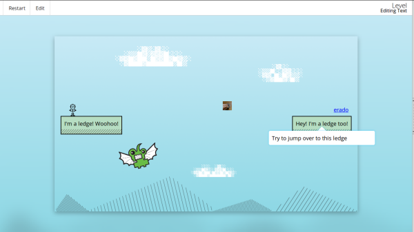

# Erase All Kittens

`Erase All Kittens` is a new open source `HTML`/`CSS` game about an _evil rebellion, intent on destroying all kittens on the Internet_. Learn to code whilst playing to help **save the kittens**, and consequently save the world!

## Try it online
We have an *early* demo you can play at [http://eraseallkittens.com/play.html](http://eraseallkittens.com/play.html) that we demonstrated during the [#MozFest 2013](http://mozillafestival.org/).



## Team & project
We’re a team of one developer, one creative and one designer who are trying to **teach kids to code with the best game we can build**.

We’ve created the story, structure and look of the game, and we’d like some help to develop it further, specifically from developers, illustrators, and level designers. Also, we need more kitten gifs.

If you’re interested in what we’ve done so far or would like to help out, we’d love to hear from you. Fill out the form on [our website](http://eraseallkittens.com/), and we'll get in touch :)

## Installing
Start by cloning the project:
```bash
git clone --recursive git@github.com:SomeHats/Erase-All-Kittens.git
cd Erase-All-Kittens
```
Then install dependendies and initialize submodule:
```bash
# install dependecies
npm install
bower install
# init and install submodule
git submodule init
git submodule update
```
You will also need to install [`brunch`](https://github.com/brunch/brunch) to be able to build the project:
```bash
# installing it globally (may require 'sudo' privileges)
npm install -g brunch
brunch build
```

## Usage
If no errors happen during build a new `public/` directory would be present. So, now you can run the app with:
```bash
brunch watch --server
```
Then, go to the app local server using [http://localhost:3333/](http://localhost:3333/). If you want to reach the game directly, add the `play.html` suffix to reach the game:

    http://localhost:3333/play.html

Enjoy hack-learning ;)

## Roadmap
* More levels ;
* More kitties >o< ;
* …
* Better, more contributor friendly docs & code comments
* Localization support.

# Documentation

## Structure
EAK is very loosely based around Backbone, mainly for its event system. `app/scripts/game/mediator` is a global event module, that also manages frames, key events, and notifications. Events from the mediator are partially documented below.

Most of the code is in `app/scripts/game`. `app/scripts` contains a few utilities and `Init`, the module that starts up the Game. `app/scripts/WebWorker` provides a layer of abstraction over Web Workers (worker modules are in `app/workers`). `app/game/dom/mapper` is a utility that carefully maps elements in the dom to be fed into the physics engine.

EAK has basic support for internationalisation. Files in `app/l10n-templates` are handlebars templates, that are merged with the contents of `app/l10n-content` to provide translated files. To create a new translation, just copy an existsing directory in `app/l10n-content` and start hacking! :) 

The l10n stuff doesn't support Brunch's watch functionality yet, but I'm working on it. 

## Mediator Events
- `frame:process` - this is triggered either 60 or 30 times a second. Any non-render tasks to be run every frame (e.g. physics)
- `frame:render` - render tasks to be run every frame
- `frame` - same as `frame:process`
- `alert` - triggering an alert causes a notification to be shown on screen.
- `resize` - window resize events
- `tilt` - abstracted device orientation events. Currently disabled.
- `uncaughtTap` - triggered when the screen is tapped / clicked but the event is not caught elsewhere
- `keypress:[keylist]`, `keyup:[keylist]`, `keydown[keylist]` - document key events for the corresponding handlers, where keylist is a comma-separated list of keys - e.g. `keydown:w,up,space` is used for making the player jump
- `prepareBackground` - takes a CSS background property, finds an  image URL, and blurs it. It can be shown later with:
- `showBackground` - Show the previously prepared background. If the background isn't prepared yet, it will be shown as soon as it is ready
- `clearBackground` - Clear a background previously set by the background manager.
